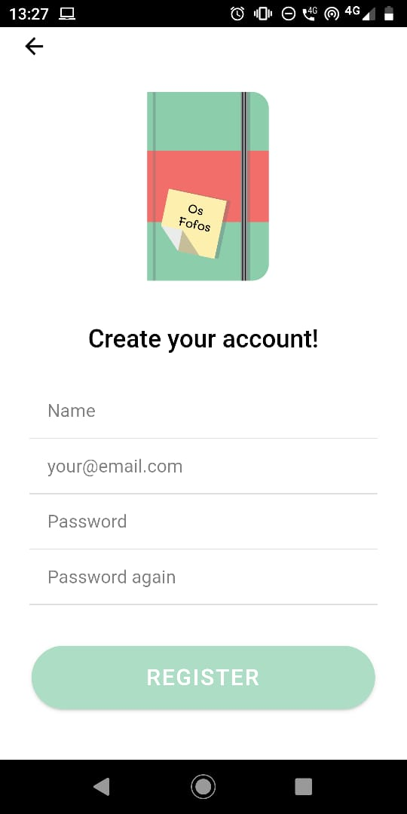

# ProjetoLabProg3 - Bullet Journal
> Trabalho de desenvolvimento realizado na disciplina de Laboratório de Programação 3 

 Foi realizada a implementação do Método Bullet Journal, modalidade clienteservidor, sendo o servidor formado por um SGBD (MySQL) e um WebService (SOAP). O lado
cliente conta com uma interface web e um app para Android, ambos desenvolvido em Ionic 4. A interface web e o app deverão possuir as mesmas funcionalidades. O sistema é multiusuário.

www.bulletjournal.com.

